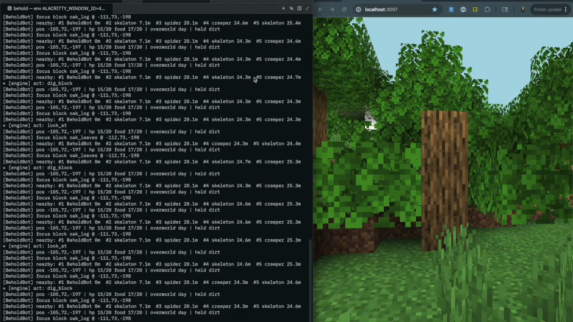

# behold

## the agents yearn for the mines

[](screenshot.mp4)

Status: 0.1.0‑alpha.0 — See [ROADMAP](docs/ROADMAP.md) for current status and priorities

North star: make worlds agents can genuinely inhabit, and learn what becomes
possible when they do. The current vertical slice is [First Life](docs/FIRST_LIFE.md).

Build and run Minecraft agents on your own server in minutes. Behold gives you:

- A tiny command API over Mineflayer (chat/look/move/dig/place/etc.).
- One serialized action stream shared by humans and LLMs, with human priority, visible deferral, and rate limits.
- A console to see state and type small commands.
- An optional LLM “autopilot” that uses the same commands.

Owned-world proof

- `npm run proof:owned-world -- --run <safe-id> --port <unused-port>` creates a new deterministic flat Minecraft world under `.behold-runtime/owned-world-proofs/`; it never reuses or modifies an external world.
- The proof uses the pinned real Minecraft 1.21.4 server, the production world owner, the real Mineflayer adapter, bounded inhabitant observations, the shared intent engine and interpreter, and the entity's authoritative Lync loom. It does not require a model API.
- The first controller observes and collects one prepared dropped-item affordance through ordinary survival mechanics. A separately admitted fresh body must see that the item is gone. The manager then stops everything cleanly, restarts the same entity, and requires the fresh process to load its prior turn, recover the server-persisted inventory consequence, and perform zero repeated collection attempts.
- A successful run writes generation output, both complete inhabitant trajectories, both hash-chained lifecycle journals, tree digests, the Lync log digest, and `evidence/report.json`. Any missing, indirect, or inconsistent assertion fails the command.

Play the San Francisco world on this Mac

- Double-click `Behold SF.app`, or run `npm run play`.
- When no server is running, the app asks the foreground managed world owner to start the server and `ScoutLife`, then launches the already-installed native Minecraft 1.21.4 client as `importdf`. Closing that managed play session drains and stops both children.
- When a server is already running, the app only attaches the human client. It reports an existing companion but never invents ownership by starting a detached controller behind an unmanaged server.
- It does not use Microsoft credentials or modify the original world. Client settings live under `.behold-runtime/native-client/game`; the playable server uses the working copy under `.behold-runtime/server`.
- The native launch log lives at `.behold-runtime/native-launch.log`; managed server/controller output remains attached to the owning command.
- Run `npm run play -- --dry-run` to validate the installed Java, libraries, assets, and launch configuration without opening Minecraft.

Managed world lifecycle (under active development)

- `npm run world -- status --config .behold-worlds.example.json --world sf-csdr` reports world-control, process ownership, world-bound controller leases, baseline, and topology evidence without changing the world.
- `npm run world -- start --config .behold-worlds.example.json --world sf-csdr` is fail-closed: it requires a clean Git worktree, an OpenRouter key, the pinned server jar, a stopped and unowned runtime, a prepared baseline, and an archive root.
- The foreground runner owns the server and controller together. A normal stop drains the controller, releases its entity lease, receives Minecraft's `save-all flush` acknowledgement, stops the JVM, verifies the port and `session.lock` are clear, and then releases its durable owner record.
- Disposable-world tests prove that a stopped lifecycle owner can authorize exactly one canonical reset transaction and rebind itself to the newly activated runtime inode. Production reset remains deliberately absent from the CLI until managed crash recovery and a named, operator-attested baseline are proven.
- Every repository-created Mineflayer body now requires its entity's unforgeable live connection capability. Managed bodies must join the exact owner epoch; unmanaged bodies check the repository-wide world-control fence both before and after creating their durable lease. The old direct server command delegates to the managed owner. Arbitrary foreign same-user processes remain outside this cooperative boundary and must not be treated as safely excluded.
- The current SF runtime is still foreign-owned and has no named prepared baseline. Status is usable now; managed start and reset remain red until that handoff is completed.

Quickstart

- Install + configure:
  - `npm install`
  - `cp .env.example .env` (edit host/username/auth; set `OPENROUTER_API_KEY` to enable autopilot)
- Run the console (starts the bot; autopilot if API key present):
  - `npm run console`
- Try a few commands:
  - `say "hi"` · `status` · `nearby` · `cursor`
  - `look @cursor` · `move to 130 64 -40 near=2` · `stop`
  - `dig @cursor` · `equip pickaxe` · `eat`

What is it?
Behold runs a Mineflayer bot and exposes a spec‑first command registry you can call from a console, an LLM, or a script. A small arbiter executes one action at a time. `stop` suspends new model work, cancels queued model intents, and asks the active adapter to cancel; pathfinding and digging only report cancellation after Mineflayer acknowledges it. Adapters without an acknowledgement still serialize and drain instead of fabricating interruption. A legacy JSONL harness also exists, but it has not yet been canonicalized against the embodied/Lync path.

Key files

- `src/index.ts` — Entry point; loads config and starts the bot + agent loop
- `src/config.ts` — Reads env vars and validates runtime config
- `src/bot.ts` — Creates the Mineflayer bot and binds core events
- Viewer: when enabled, starts a local web viewer (prismarine-viewer) on spawn
- `src/agent/loop.ts` — Agent loop runner (tick-based)
- `src/agent/reasoner.ts` — Minimal reasoner; uses OpenRouter chat (no tools) or a tiny fallback
- `src/agent/observation.ts` — Shared observation builder for bot state
- `src/agent/harness_stdio.ts` — JSONL stdio harness for external control
- `src/cli/main.ts` — Transitional CLI (`tools`, `agent --stdio`)
- `src/loop/*` — Arbiter + engine skeleton
- `src/runtime/world-control.ts` — Durable, token-checked ownership record for a managed world process
- `src/tui/*` — Console REPL (preview)
- `src/input/keyboard.ts` — Terminal keyboard controls (WASD, jump, crouch, sprint, look, chat)
- `src/tools/index.ts` — Registry of callable tools the reasoner can invoke
- `scripts/swarm.ts` — Multi-bot launcher for local/offline testing
- `scripts/world-runner.ts` — Foreground server/controller lifecycle and refusal gates
- `.env.example` — Example environment variables to copy into `.env`

Prerequisites

- Node.js 22 or newer (the package engine floor)
- A reachable Minecraft server (local or remote)
- For online mode: a valid account and correct `MINECRAFT_AUTH`
- OpenRouter API key if you want LLM chat replies
- Optional: local browser for the viewer
- For the viewer on Node: `canvas` native module. You may need system packages.
  - macOS (Homebrew): `brew install pkg-config cairo pango libpng jpeg giflib librsvg`
  - Ubuntu/Debian: `sudo apt-get install -y build-essential libcairo2-dev libpango1.0-dev libjpeg-dev libgif-dev librsvg2-dev`
  - Alpine: `apk add --no-cache build-base cairo-dev pango-dev jpeg-dev giflib-dev`

Setup

1. Copy the env template and edit values as needed:
   ```bash
   cp .env.example .env
   # then edit .env with your server + credentials
   ```
2. Install dependencies:
   ```bash
   npm install
   ```
3. Start the bot (builds TypeScript into `dist/` first):
   ```bash
   npm start
   ```
   If the viewer is enabled (default), open http://localhost:3007 to watch.
   If you see an error about missing `canvas`, install it after the system packages:
   ```bash
   npm i canvas
   ```

If you don’t provide an OpenRouter key, the agent uses a tiny rule-based fallback so the bot is still runnable.

Environment Variables

- `SERVER_HOST` — Server hostname or IP (default `localhost`)
- `SERVER_PORT` — Server port (default `25565`)
- `MINECRAFT_USERNAME` — Bot username (or email for online mode)
- `MINECRAFT_PASSWORD` — Password (leave empty for offline)
- `MINECRAFT_AUTH` — `offline` or `microsoft` (default `offline`)
- `AGENT_TICK_MS` — Agent loop tick interval (default `4000`)
- `KEY_MODE` — `hold` (default) for MC-like holding keys, or `toggle`
- `VIEWER_ENABLED` — `1` to enable the web viewer (default `1`)
- `VIEWER_PORT` — viewer port (default `3007`)
- `VIEWER_FIRST_PERSON` — `1` for first-person camera, `0` for third-person (default `1`)
- `OPENROUTER_API_KEY` — API key for OpenRouter (optional)
- `OPENROUTER_BASE_URL` — Override OpenRouter base (default `https://openrouter.ai/api/v1/chat/completions`)
- `OPENROUTER_REFERER` — Optional Referer header for OpenRouter
- `OPENROUTER_TITLE` — Optional X-Title header for OpenRouter
- `LLM_MODEL` — exact OpenRouter model slug (default `openai/gpt-5.6-luna`)

LLM Autopilot (optional)

- Set `OPENROUTER_API_KEY` and choose an exact model via `LLM_MODEL` (defaults to `openai/gpt-5.6-luna`).
- The console starts a function‑calling “policy” that proposes one tool per tick using the same command registry you use as a human.

Command registry and tools

- Interpreter commands live in `src/agent/interpreter.ts` (chat/look/move/dig/place/inventory/sense).
- Tools in `src/tools/index.ts` expose the same surface:
  - `list_commands`, `describe_command`, `run_command` — discovery and execution
  - Backwards‑compatible simple tools (e.g., `say`, `move_to`, `get_status`) remain available

Fallback behavior

- If no LLM is configured, the bot uses a small rule: if someone mentions the bot’s username in chat, it replies with a greeting via `say`.

Running Tips

- Offline/LAN servers: set `MINECRAFT_AUTH=offline` and provide a `MINECRAFT_USERNAME`
- Online servers (Microsoft): set `MINECRAFT_AUTH=microsoft` and provide username/email + password as required by your setup
- You can tune `AGENT_TICK_MS` to slow down or speed up the agent loop

Swarm (multi-bot)

- Copy `bots.example.json` to `bots.json` and edit usernames (use offline mode).
- Run `npm run swarm` to launch all bots as child processes.
- Each child disables terminal keyboard by default (`KEYBOARD=0`).
- Optional: set `spawnDelayMs` in `bots.json` (default 5000ms), or pass `--delay 5000` to CLI.
- Auto-retry: if a bot exits quickly or is throttled, the launcher retries with backoff (defaults: `maxRetries=5`, `retryBaseMs=3000`). You may add these to `bots.json`.

If you see "Connection throttled! Please wait before reconnecting."

- Many Paper/Spigot servers throttle rapid connects from the same IP (commonly ~4000ms window).
- Fix by staggering launches (use `spawnDelayMs`/`--delay` set to ≥ 4500–5000ms), or raise/disable the server’s connection throttle (in `bukkit.yml`, set `settings.connection-throttle: -1`).

Keyboard controls (terminal)

- `w/a/s/d` — move (hold)
- `space` — jump (hold)
- `z` — toggle sneak (crouch)
- `f` — sprint (hold)
- Arrow keys — look around
- `t` — prompt for a chat line to send
- `q` — drop held item stack
- `x` — stop all movement
- `h` — help
- `Ctrl+C` — exit

Viewer

- Powered by `prismarine-viewer`. By default it launches on spawn at `http://localhost:3007`.
- Toggle via `VIEWER_ENABLED=0` or change port with `VIEWER_PORT`.
- First-person view can be switched with `VIEWER_FIRST_PERSON=0`.

JSONL Stdio Harness

- Purpose: let an external LLM (or controller) run the observe–think–act loop via JSONL over stdio.
- Start:
  ```bash
  npm run agent:stdio -- --maxSteps 50 --allowTools say,move_to
  ```
- Protocol (stdout):
  - `{ "event": "hello", "username": "...", "specs": [...] }`
  - `{ "event": "observation", "data": { ... } }`
  - `{ "event": "status", "phase": "observing|thinking|acting|waiting", "step": 1 }`
  - `{ "event": "tool_result", "id": "call-123", "ok": true, "result": { ... } }`
- Actions (stdin, one JSON per line):
  - `{"action":"call","id":"call-123","tool":"say","input":{"text":"hi"}}`
  - `{"action":"wait"}`
  - `{"action":"final","text":"see ya"}`
- Options (`npm run behold -- agent --stdio`): `--tickMs`, `--thinkTimeoutMs`, `--maxSteps`, `--rateMax`, `--rateWindowMs`, `--allowTools <csv>`.

What you can do today

- Console (preview): `npm run console` — human commands; LLM autopilot if `OPENROUTER_API_KEY` is set.
- Tools manifest (for LLMs): `npm run behold -- tools --json`.
- Automation (JSONL): `npm run agent:stdio` then send one line per action.

What’s next

- Unified CLI: `behold <AgentName> [--model ...]` (autonomous by default) with inline controls.
- Console polish: tab completion, tokens (@nearest/#idx), confirmations, watch, propose/selected logs.
- Policy: better heuristics, arg validation, richer context.

Roadmap

- Unified CLI: `behold <AgentName> [--model ...]` (autonomous by default) with inline controls.
- Console polish: tab completion, tokens (@nearest/#idx), confirmations, watch, propose/selected logs.
- Policy: better heuristics, arg validation, richer context.

Safety
Autonomous bots can spam or grief if misconfigured. Start on a private test server, audit tool capabilities, and add guardrails or rate limits before deploying anywhere public.

---

Happy hacking! PRs and ideas welcome.

Development

- Language: TypeScript (compiled to `dist/`)
- Build: `npm run build` (tsc)
- Run: `npm start` (builds then runs `node dist/src/index.js`)
- Dev (ts-node): `npm run dev` (runs `src/index.ts` directly)
- CLI chat: `npm run cli` (ts-node)
- Swarm: `npm run swarm` (builds then runs `dist/scripts/swarm.js`)
- Lint: `npm run lint` (ESLint)
- Format: `npm run format` (Prettier)
- Check: `npm run check` (ESLint + Prettier check)
- Conventional commits enforced via commitlint (Husky `commit-msg` hook)
- Pre-commit runs lint-staged to format and fix changed files

Setup hooks
Hooks are configured but require dependencies installed. Run:

```bash
npm install
npm run prepare  # sets up Husky
```
