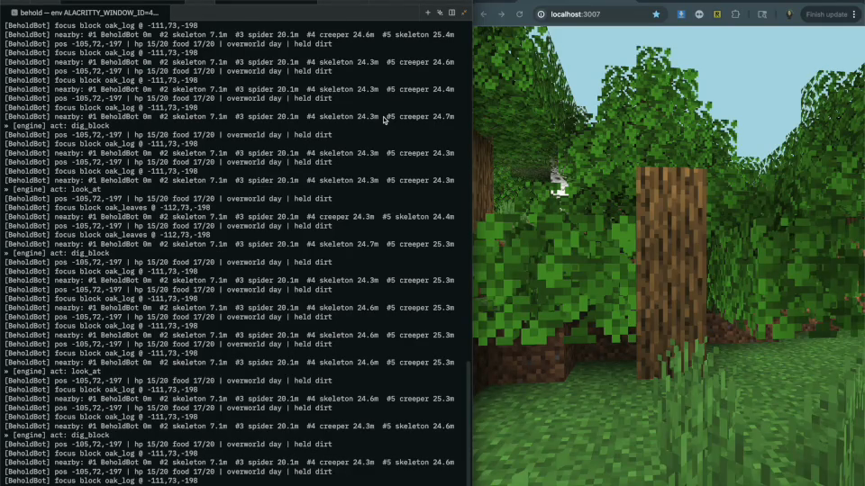

# behold

## the agents yearn for the mines

[](screenshot.mp4)

Status: 0.1.0‑alpha.0 — See [ROADMAP](docs/ROADMAP.md) for current status and priorities

North star: make worlds agents can genuinely inhabit, and learn what becomes
possible when they do. The current vertical slice is [First Life](docs/FIRST_LIFE.md).
The smallest current-version composition is the
[irreducible resident loop](docs/FIRST_LIFE.md#the-irreducible-loop): bounded
experience, one choice, one bodily attempt, Minecraft consequence, and
continuing own-life history.

Product horizon: choose or compile a persistent world—including a geographic
place such as San Francisco—start it with ordinary Minecraft ecology, attach
several independently minded player characters, and watch their lives unfold
in real time. A person should be able to join the same world through the native
client. Each resident may use a different model or mind program, while world
changes remain Minecraft-authoritative and resident/world histories remain
portable Lync that can be inspected with tools such as Textile.

The First Life vertical slice now crosses its bounded living-Place acceptance,
but the broader product is not a finished living-world treatment.
`behold live` now composes an accepted Place release, persistent named lives,
independently configured resident sessions, viewer discovery, a native-client
endpoint, clean stop/resume, and an authenticated episode record in one foreground
operator entry. It does not launch a human client or run Textile on the
operator's behalf. Ordinary live use has now exercised bounded perception,
admitted actions, returned consequences, continuity, and human coexistence
through a 30-minute resident epoch and a fresh resume. Residents have made
repetitive, ineffective, and consequential choices; those choices are observed
conduct, not a product score. Passing the mechanics stack is therefore not
presented as a finished living world.

The smaller action-only `resident-v2` path has crossed an ordinary two-resident
live/lens/stop/resume exercise. Elm and Pine shared one Gemma 4 12B LM Studio
weight instance while keeping separate requests and Lync lives. They completed
looking, movement, communication, attack, and digging choices; Pine's resumed
dig produced a Minecraft-confirmed mud-bricks-to-air change. Resume reopened the
saved bodies and supplied Elm only its own first five turns and Pine only its
own first six. Successful local decisions had median upstream latency of about
9.7 seconds initially and 12.4 seconds after resume; both episodes saved and
stopped cleanly. Textile independently read the exact 563,992-byte frozen union
as 15 turns plus two roots with no unsupported or nonconforming results. The
additive `org.behold.inhabitant.v2` presentation pact and vendored Lync 0.4.2
make its sound, time, whisper, action, failure, and verified material consequence
readable without exposing coordinates or private controller/provider fields.
Old v1 lives and presentation remain unchanged. This establishes the compact
causal composition, not the quality or long-term variety of resident conduct.

An opt-in `semantic-plus-camera-v1` perception treatment now augments the same
bounded semantic observation with one content-addressed frame from that
resident's exact first-person camera. The ordinary default remains
`semantic-only-v1`; camera mode is currently admitted only through a fresh
vision-capable LM Studio inventory and fails closed rather than silently
downgrading. No-world image-plus-schema gates pass for the installed Gemma 4
12B and Qwen 3.6 35B-A3B when their exact non-reasoning setting is present.
Persistent-world image delivery and the sealed model-by-perception comparison
remain unexercised.

The latest exercised local path has carried two Qwen 3.6 35B-A3B residents
through ordinary live episodes and resumes with one shared LM Studio weight
instance and isolated own-life context. A native Java client joined as
`importdf`, moved and chatted with both residents, left on clean stop, and
returned after resume; both resident journals and the Place server log witnessed
the joins. Moss later chose to dig one gray-concrete block, and a second restart
reopened the saved chunk with air at that coordinate and dirt below. Episodes
000036-000037 then exercised long-life context maintenance: each resident built
a separate bounded index over more than 900 canonical turns without a provider
fold call, continued choosing actions, stopped cleanly, and received that index
in its first decision request after resume. Both indexes retained the human's
exact earlier request and Minecraft-confirmed block changes. Textile's ordinary
raw-Lync projector reads episode 000037's 96 MB frozen union as 1,880 readable
turns plus two structural roots with no unsupported, nonconforming, or warning
results. Episode 000039 then sustained the same composition for 30 post-release
minutes: 340 model decisions produced 308 successful action terminals and four
verified block changes with no model-call failure. A native player rejoined and
both residents received the player's chat. Episode 000040 resumed each private
life from its saved body/world state; both first requests contained the newest
human dialogue and material consequences. Textile's raw-Lync projector reads
its 2,435-event frozen union as 2,433 readable resident events plus two
structural roots with no diagnostics. Dense pressure-plate activity exposed
bounded event deferrals: repetitive sound records and invisible controller
lifecycle copies could outrun the resident's 40-event body history. The model
projection now consumes controller copies without spending perceptual slots and
represents consecutive ordinary sounds as a typed causal sequence with exact
ranges, counts, and changing acoustic content. Replaying episode 000039's
complete 1,393/1,350-event resident streams through that path produced zero
missing or omitted windows at the original decision cadence; the full check and
a sustained bounded-history policy test also pass. The repair has not yet been
repeated in a new live pressure-plate episode. Qwen's repetitive social language
and unsupported perceptual claims remain observed model conduct, not harness
failures by definition.

A heterogeneous OpenRouter comparison then exercised the same continuing lives
with GPT-5.6 Luna and Gemini 3.6 Flash. In episode 000042 Luna drove Iris from
the shared structure down to y=-63 while Gemini kept Moss in the upper
excavation; both made Minecraft-confirmed block changes, and Moss interpreted
and addressed Iris's held dirt through ordinary resident perception. A
resident-quota lifecycle mismatch left that saved epoch recovery-required
rather than clean. Ordinary `behold live --recover` adopted its exact saved
world, and episode 000043 reopened Iris in the shaft with the same inventory
and Moss in the upper worksite with separate 1,282/1,315-turn histories. Their
first requests contained only their own recent confirmed excavation outcomes;
both continued digging without a task or preferred action. The three-minute
resume settled 76 decisions, saved and stopped cleanly, and Textile projected
its 2,674-event frozen Lync union as 2,672 readable resident events plus two
structural roots with no diagnostics. This shows that the ordinary harness can
carry distinct timely model trajectories and material continuity; it does not
show rich open-ended agency, because repetitive excavation remained the
dominant attractor.

After the perception repair, episodes 000044-000045 exercised the current tree
through the ordinary front door with Luna driving Iris and Gemini driving Moss.
Across 164 model turns, every model-facing event window was complete with zero
missing or omitted events. Moss chose and completed 32 Minecraft-confirmed
block changes, moved from y=-50 to y=-60, and reopened there after clean stop
with 14 dirt, coal and stone in view, and its own recent excavation consequences
in the first request. Iris remained in her separate shaft and retained 36
failures rather than receiving hidden recovery. Episode 000044's optional
`--native-player importdf` assessment failed because the client did not join;
the world still saved cleanly, but that episode is not human-entry evidence.
Episode 000045 then stopped cleanly without that assertion. Textile projected
their final 2,838-event, 147 MB Lync union as 2,836 readable resident events plus
two structural roots with no diagnostics. The two episodes cost $0.5672, taking
the known workshop aggregate to about $31.01. Together with episodes
000031-000033's authenticated human join and return, shared-weight isolation,
persistent Minecraft consequence, and visible Textile review, this satisfies
the current First Life milestone without grading resident conduct. Longer
household-scale life, richer world-history views, survival competence, and
social adaptation remain open horizons.

Persistent living Place

- `behold live RELEASE --residents FILE --accept-eula --session NAME` verifies
  and serves one Place release and creates its named world and resident
  population. Later `behold live RELEASE --accept-eula --session NAME` resumes
  the authenticated resident revision already owned by that session; an ignored
  operator input file is not a second durability dependency. Use `--duration
SECONDS` for a bounded episode; Ctrl-C requests the same clean drain, save,
  and stop path.
- If the owning process dies before that path publishes its terminal record,
  repeat the same command with `--recover`. Recovery starts no world or model:
  it releases only an exact dead local owner with clear process, lease, lock,
  port, and unchanged runtime evidence, and keeps the interrupted run distinct
  from a clean episode.
- The foreground output prints the loopback native Minecraft endpoint and one
  read-only first-person viewer URL per resident. Joining with a compatible
  native client is optional and does not transfer world ownership away from the
  foreground command.
- Any compatible Minecraft client may join the printed endpoint while the world
  is live; no declaration releases or directs the residents. The optional
  `--native-player USERNAME` flag adds a post-episode observation check for one
  username. It cannot establish client provenance, and it is not required for
  ordinary human entry.
- A clean stop records the new persistent world head and an authenticated episode
  record. The record binds the Place control transcript, byte-identical Place-owned
  Minecraft server log, cognition/accounting evidence, per-life body journals,
  episode-local byte-identical Lync snapshots, and closed viewer endpoints. It
  also emits one `textile-resident-lives.lync` byte union as a viewing convenience.
  The original Lync multiversal logs remain canonical; Textile is an interface
  for viewing them through profile `org.behold.inhabitant.v1`, and Behold does
  not render or rewrite those histories.
- Repeating the printed resume command and session name resumes the same stopped
  world, bodies, life looms, and resident configuration. Each new episode receives a
  fresh, explicitly bounded provider-attempt scope under the persistent session
  namespace; prior usage remains in its original ledger and is never balanced
  between residents. Changing the release or population under an existing name
  fails closed.
- `--change-minds --residents FILE` explicitly changes only model/mind transport
  and attempt quotas for the same named residents. The append-only revision refuses changes
  to bodies, profiles, cadence, tasks, or other steering, so a continuing life
  can change minds without silently becoming another resident.

Build and run Minecraft agents on your own server in minutes. Behold gives you:

- A tiny command API over Mineflayer (chat/look/move/dig/place/etc.).
- One serialized action stream shared by humans and LLMs, with human priority, visible deferral, and rate limits.
- A console to see state and type small commands.
- An optional LLM “autopilot” that uses the same commands.

Owned-world proof

- `npm run server:jar` fetches the Minecraft 1.21.4 server named in the tracked tool lock when it is absent, then verifies its byte count, SHA-1, and SHA-256 before atomically installing it. It is a no-op when the correct jar is already present and refuses to overwrite a different file. `npm run server:jar:check` verifies without downloading.
- `npm run proof:owned-world -- --run <safe-id> --port <unused-port>` creates a new deterministic flat Minecraft world under `.behold-runtime/owned-world-proofs/`; it never reuses or modifies an external world.
- The proof uses the pinned real Minecraft 1.21.4 server, the production world owner, the real Mineflayer adapter, bounded inhabitant observations, the shared intent engine and interpreter, and the entity's authoritative Lync loom. It does not require a model API.
- The first controller observes and collects one prepared dropped-item affordance through ordinary survival mechanics. A separately admitted fresh body must see that the item is gone. The manager then stops everything cleanly, restarts the same entity, and requires the fresh process to load its prior turn, recover the server-persisted inventory consequence, and perform zero repeated collection attempts.
- A successful run writes generation output, both complete inhabitant trajectories, both hash-chained lifecycle journals, tree digests, the Lync log digest, and `evidence/report.json`. Any missing, indirect, or inconsistent assertion fails the command.

Place Compiler boundary

- Behold owns world epochs, resident identity, bodies, cognition, lifecycle, and consequence proofs. It does not own geographic compilation.
- A Place Compiler release crosses into Behold only as an independently verifiable artifact: `release-manifest.json`, `SHA256SUMS`, and immutable-world, generation-evidence, reproduction-kit, and input archives. For privacy-safe schema-V3 admission, Behold invokes the exact canonical Place verifier at an explicitly pinned revision, records that result and the release identities, recomputes the portable world-tree digest, applies a named runtime profile to a separate baseline, and then assigns its own content-bound world and epoch identities. The aggregate digest used to preserve a mounted artifact is preservation evidence, not a parallel release protocol.
- `behold live` can own Place's ordinary `serve --control-jsonl` child from either the historical exact checkout (`--place-compiler`) or a read-only installed CLI. Installed mode requires `--place-compiler-bin`, `--place-compiler-version`, and `--place-compiler-distribution-sha256`; take the latter two values from that binary's `place-compiler version --json`. Behold repeats that preflight before serving and requires the unchanged `place-compiler-serve-control/v1` wire and schema-V3 capability. Both modes use the same lifecycle parser, exact release/world/server/runtime identities, and fail-closed shutdown.
- Place Compiler source, recipes, benchmarks, and presentation machinery remain outside this controller product. `scripts/place-epoch.ts` is the narrow admission adapter; schema V2 remains an explicit legacy integrity-only path and is ineligible for privacy-safe runs.

Configure a managed world

- The tracked `.behold-worlds.example.json` is a portable template only. It contains placeholder paths and no workstation identity.
- Run `npm run world:init` once to copy that template to the ignored local `behold-worlds.json`, then replace its paths, source digest, and prepared baseline with values for this machine. The command refuses to overwrite an existing local registry.
- Configuration resolution is consistent across the managed runner and play surface: explicit `--config <path>`, then `BEHOLD_WORLD_CONFIG`, then the ignored `behold-worlds.json` in the working directory.
- Keep immutable source, a distinct stopped prepared baseline, the disposable runtime, and its archive root at disjoint absolute paths. A source world is provenance and is never silently promoted into a runnable baseline.

Play a locally configured world

- For the shortest operator-facing entry, use the
  [First Life operator entry](docs/FIRST_LIFE_OPERATOR.md): status, provider-free
  dry run, native play, and verified shutdown.
- Run `npm run play -- --world <id>`, optionally with `--config <path>`. A workstation may also provide its own launcher around this command; launchers and machine paths are not part of the portable product contract.
- When no server is running, play asks the foreground managed world owner to start the server and configured companion, then launches the locally configured native Minecraft 1.21.4 client. Without an OpenRouter key the companion connects paused, so human play still works without a provider call. Closing that managed play session drains and stops both children.
- When a server is already running, the app only attaches the human client. It reports an existing companion but never invents ownership by starting a detached controller behind an unmanaged server.
- It does not use Microsoft credentials or modify the original world. Client settings live under `.behold-runtime/native-client/game`; the playable server uses the working copy under `.behold-runtime/server`.
- The native launch log lives at `.behold-runtime/native-launch.log`; managed server/controller output remains attached to the owning command.
- Run `npm run play -- --dry-run` to validate the installed Java, libraries, assets, and launch configuration without opening Minecraft.
- The preserved `ScoutLife` autobiography remains bound to its original endpoint-circle identity. Behold does not silently relabel that life as `sf-csdr`; continuing it under the managed world requires an explicit future crossing decision.

Managed world lifecycle (under active development)

- `npm run world -- status --world <id>` reports world-control, process ownership, world-bound controller leases, baseline, and topology evidence without changing the world. It uses the ignored local registry unless `--config` or `BEHOLD_WORLD_CONFIG` selects another one.
- `npm run world -- start --world <id>` is fail-closed: it requires a clean Git worktree, the pinned server jar, a stopped and unowned runtime, a prepared baseline, and an archive root. Residents may be connected paused without a model key; active cognition requires its configured provider credentials.
- The foreground runner owns the server and controller together. A normal stop drains the controller, releases its entity lease, receives Minecraft's `save-all flush` acknowledgement, stops the JVM, verifies the port and `session.lock` are clear, and then releases its durable owner record.
- If an abnormal child exit leaves a stopped same-host owner in `recovery_required`, `npm run world -- recover --world <id>` verifies the lifecycle journal, dead process set, unchanged runtime identity, clear port and session lock, and clear controller leases. It preserves prepared and completed recovery evidence before releasing the fence; it does not reset the world.
- Disposable-world tests prove that a stopped lifecycle owner can authorize exactly one canonical reset transaction and rebind itself to the newly activated runtime inode. Production reset remains deliberately absent from the CLI; abandoned-owner recovery preserves the current runtime and does not grant reset authority.
- Every repository-created Mineflayer body now requires its entity's unforgeable live connection capability. Managed bodies must join the exact owner epoch; unmanaged bodies check the repository-wide world-control fence both before and after creating their durable lease. The old direct server command delegates to the managed owner. Arbitrary foreign same-user processes remain outside this cooperative boundary and must not be treated as safely excluded.
- Runtime and baseline locations are deliberately local concerns. They belong in ignored `behold-worlds.json`, never in the tracked portable template.

Quickstart

- Install + configure:
  - `npm install`
  - `npm run server:jar` (needed for owned-world proofs and local managed worlds)
  - `cp .env.example .env` (edit host/username/auth; set `OPENROUTER_API_KEY` to enable autopilot)
  - `npm run world:init` (then edit the ignored `behold-worlds.json` for this machine)
- Run the console (starts the bot; autopilot if API key present):
  - `npm run console`
- Try a few commands:
  - `say "hi"` · `status` · `nearby` · `cursor`
  - `look @cursor` · `move to 130 64 -40 near=2` · `stop`
  - `dig @cursor` · `equip pickaxe` · `eat`

What is it?
Behold runs a Mineflayer body through one embodied resident runtime shared by the interactive console and managed `behold live` residents. That runtime composes bounded experience, current physical affordances, a replaceable mind, the serialized intent engine, and the resident's Lync life. `stop` suspends new model work, cancels queued model intents, and asks the active adapter to cancel; pathfinding and digging only report cancellation after Mineflayer acknowledges it. Adapters without an acknowledgement still serialize and drain instead of fabricating interruption. The older tick/reasoner entry and JSONL harness remain compatibility surfaces, not equivalent resident paths.

Key files

- `src/runtime/resident-config.ts` — Pure process-boundary resolver for one explicit resident runtime configuration
- `src/tui/console.ts` — Canonical embodied resident composition used by interactive and managed resident entry
- `src/index.ts` — Legacy tick/reasoner entry retained for compatibility; not the resident product path
- `src/config.ts` — Reads env vars and validates runtime config
- `src/bot.ts` — Creates the Mineflayer bot and binds core events
- `src/observability/resident-viewer.ts` — Loopback-only read-only resident POV; its optional capture seam lazily renders one exact pose-bound frame through installed Chrome without adding a control bridge
- `src/perception/resident-camera-frame.ts` — Content-addressed resident frame, renderer, observation, body/eye-pose, and freshness binding
- `src/agent/loop.ts` — Legacy tick loop retained for compatibility
- `src/agent/reasoner.ts` — Legacy mention-oriented reasoner; not used by the embodied resident path
- `src/agent/observation.ts` — Shared observation builder for bot state
- `src/agent/harness_stdio.ts` — JSONL stdio harness for external control
- `src/cli/main.ts` — Transitional CLI (`tools`, `agent --stdio`)
- `src/loop/*` — Arbiter + engine skeleton
- `src/runtime/world-control.ts` — Durable, token-checked ownership record for a managed world process
- `src/tui/*` — Console REPL (preview)
- `src/input/keyboard.ts` — Terminal keyboard controls (WASD, jump, crouch, sprint, look, chat)
- `src/tools/index.ts` — Registry of callable tools the reasoner can invoke
- `scripts/world-runner.ts` — Foreground server/resident lifecycle, population budgets, and refusal gates
- `src/observability/quota-ledger.ts` — Durable per-resident/per-purpose provider-attempt accounting
- `.env.example` — Example environment variables to copy into `.env`

Prerequisites

- Node.js 22.12 or newer (the package engine floor)
- `npm ci` installs the tracked Lync 0.4.2 release-candidate artifact under
  `vendor/`. It is built from clean owning revision `0ec1b37`; this temporary
  pin keeps the repaired canonical writer reproducible without publishing it.
- A reachable Minecraft server (local or remote)
- For online mode: a valid account and correct `MINECRAFT_AUTH`
- OpenRouter API key if you want LLM chat replies
- Optional: local browser for the viewer
- Optional for the camera-perception comparison: installed Chrome, Chromium, or Edge; `BEHOLD_CHROME_EXECUTABLE` selects a nonstandard executable. Semantic-only residents never launch it.
- For the viewer on Node: `canvas` native module. You may need system packages.
  - macOS (Homebrew): `brew install pkg-config cairo pango libpng jpeg giflib librsvg`
  - Ubuntu/Debian: `sudo apt-get install -y build-essential libcairo2-dev libpango1.0-dev libjpeg-dev libgif-dev librsvg2-dev`
  - Alpine: `apk add --no-cache build-base cairo-dev pango-dev jpeg-dev giflib-dev`

Setup

1. Copy the env template and edit values as needed:
   ```bash
   cp .env.example .env
   # then edit .env with your server + credentials
   ```
2. Install dependencies:
   ```bash
   npm install
   ```
3. Start the bot (builds TypeScript into `dist/` first):
   ```bash
   npm start
   ```
   If the viewer is enabled (default), open http://localhost:3007 to watch.
   If you see an error about missing `canvas`, install it after the system packages:
   ```bash
   npm i canvas
   ```

If you don’t provide an OpenRouter key, the interactive bot remains runnable but LLM autopilot is disabled.

Environment Variables

- `SERVER_HOST` — Server hostname or IP (default `localhost`)
- `SERVER_PORT` — Server port (default `25565`)
- `MINECRAFT_USERNAME` — Bot username (or email for online mode)
- `MINECRAFT_PASSWORD` — Password (leave empty for offline)
- `MINECRAFT_AUTH` — `offline` or `microsoft` (default `offline`)
- `AGENT_TICK_MS` — Agent loop tick interval (default `4000`)
- `BEHOLD_URGENT_DECISION_TIMEOUT_MS` — wall-clock deadline for one newly urgent bodily decision (default `5000`)
- `KEY_MODE` — `hold` (default) for MC-like holding keys, or `toggle`
- `VIEWER_ENABLED` — `1` to enable the web viewer (default `1`)
- `VIEWER_PORT` — viewer port (default `3007`)
- `VIEWER_FIRST_PERSON` — `1` for first-person camera, `0` for third-person (default `1`)
- `OPENROUTER_API_KEY` — API key for OpenRouter (optional)
- `OPENROUTER_BASE_URL` — Override OpenRouter base (default `https://openrouter.ai/api/v1/chat/completions`)
- `OPENROUTER_REFERER` — Optional Referer header for OpenRouter
- `OPENROUTER_TITLE` — Optional X-Title header for OpenRouter
- `LLM_MODEL` — exact OpenRouter model slug (default `google/gemini-3.5-flash`)
- `LLM_URGENT_MODEL` — optional separately authorized model for newly urgent bodily attention
- `BEHOLD_MIND` — bounded decision adapter: `direct` (default) or `ax`
- `BEHOLD_POLICY_PROFILE` — action-only ordinary `resident-v2` (default), coached legacy `resident-v1`, strategy-minimal evaluation `neutral-benchmark-v1`, or narrated legacy treatment `legible-resident-v1`
- `BEHOLD_BODY_PROFILE` — `minecraft-resident-v1` or the human-comparable semantic contract `minecraft-human-semantic-v1`
- `BEHOLD_ACTION_PROFILE` — `resident-v1`, legacy `minecraft-player-v1`, or the cursor/key-like `minecraft-human-semantic-v1` surface
- `BEHOLD_SAFETY_PROFILE` — `resident-safe-v1` or `vanilla-player-v1`; the latter exposes risky actions that ordinary Minecraft permits
- `BEHOLD_RECORD_MODEL_IO=1` — opt in to storing full provider request/response bodies for exact replay; the default records hashes and byte attribution without copying private lived context
- `BEHOLD_CHROME_EXECUTABLE` — optional installed Chrome/Chromium/Edge path used only when an exact resident-camera frame is explicitly requested
- `BEHOLD_OLLAMA_SERVER_CONFIG` — optional path to the plain local Ollama server config; local managed admission defaults to `~/.ollama/server.json` and requires `disable_ollama_cloud: true`

LLM Autopilot (optional)

- Set `OPENROUTER_API_KEY` and choose an exact model via `LLM_MODEL` (defaults to `google/gemini-3.5-flash`).
- The ordinary `resident-v2` policy proposes exactly one admitted action or explicit yield using the human-semantic body. It supplies persistent identity, bounded own-life continuity, independent others, controls as attempts, and Minecraft consequences as authority—without a task, project, progress judgment, recovery choice, required action, or compulsory narration. Provider use requires the action-only OpenRouter v2 resident session; LM Studio uses `behold.lmstudio-local-resident-session.v2`. Current Ollama transports are legacy-only. Behold still validates and executes every proposal.
- On restart, canonical Lync remains unchanged. `resident-v2` rebuilds a profile-bound, deterministic factual view containing chosen controls, typed terminal settlements, communication, and coarse post-action perception; it neither replays legacy commitments nor asks a model to infer projects for memory.
- `resident-v1` and `legible-resident-v1` remain readable, runnable named legacy treatments; changing the ordinary default does not reinterpret their histories.
- For a new neutral evaluation, set `BEHOLD_POLICY_PROFILE=neutral-benchmark-v1`. Unless explicitly overridden, that selects the matching `minecraft-human-semantic-v1` body and action contracts plus `vanilla-player-v1` risk. Every managed run journals all four profile identities. The older `minecraft-player-v1` action benchmark must now be selected explicitly with `minecraft-resident-v1`.
- The exact v1 human-comparable contract, exclusions, unchanged causal kernel, and conformance plan live in [Human-comparable semantic Minecraft body](docs/HUMAN_SEMANTIC_BODY.md).
- The exact charter, strict public-commitment response, persistence boundary, and comparison with the two older policy profiles live in [Legible resident treatment v1](docs/LEGIBLE_RESIDENT_TREATMENT.md).

Trajectory counterfactuals

Use a captured model turn to compare a current direct or Ax mind without exposing
an executable command or mutating Minecraft:

```bash
npm run eval:mind-differential -- \
  --journal .behold-runs/<run>/<resident>/<journal>.jsonl \
  --model-turn <journal-sequence> \
  --model <optional-candidate-slug> \
  --candidate direct \
  --out .behold-runs/<run>/<resident>/<comparison>.json
```

The report binds the captured and replayed observation hashes, records any
explicit observation migration, and rejects the candidate proposal at the
admission boundary. Omit `--model` to replay the captured model. Use
`--profile-only` instead of `--candidate` to reconstruct and partition the
current request without a provider call or executable functions. It compares
that request with the captured direct-provider body hash and exits nonzero when
the bytes differ; a mismatch is diagnostic evidence, not an exact replay.

For a matched fast/slow attention measurement, select a captured turn that
contains a newly urgent event:

```bash
npm run eval:mind-differential -- \
  --journal .behold-runs/<run>/<resident>/<journal>.jsonl \
  --model-turn <journal-sequence> \
  --attention-pair \
  --out .behold-runs/<run>/<resident>/<attention-comparison>.json
```

Both provider calls receive the exact same model, current observation, action
schemas, and required-action state. The runner varies only the working-context
mode, adds the same unique cache-control provenance to both prompts, records
provider cache usage, and admits neither proposal into Minecraft.

Command registry and tools

- Interpreter commands live in `src/agent/interpreter.ts` (chat/look/move/dig/place/inventory/sense).
- Tools in `src/tools/index.ts` expose the same surface:
  - `list_commands`, `describe_command`, `run_command` — discovery and execution
  - Backwards‑compatible simple tools (e.g., `say`, `move_to`, `get_status`) remain available

Fallback behavior

- If no LLM is configured, the bot uses a small rule: if someone mentions the bot’s username in chat, it replies with a greeting via `say`.

Running Tips

- Offline/LAN servers: set `MINECRAFT_AUTH=offline` and provide a `MINECRAFT_USERNAME`
- Online servers (Microsoft): set `MINECRAFT_AUTH=microsoft` and provide username/email + password as required by your setup
- You can tune `AGENT_TICK_MS` to slow down or speed up the agent loop

Managed population

- `npm run swarm -- --world <id> --controller Scout --controller Builder` is an alias for the canonical managed-world runner.
- Repeating `--controller` admits independently leased resident lives into one exact world epoch. They keep distinct observations, journals, Lync autobiographies, models, and body authority. A matching repeated `--body` may explicitly name each Minecraft username when it differs from the life ID; `--paused` connects those bodies without starting cognition.
- `--model`, `--mind direct|ax`, and `--tickMs` remain convenient shared values for the repeated-controller form. For heterogeneous residents, use the versioned `--residents <json-file>` operator path in [`docs/MANAGED_RESIDENT_SET.md`](docs/MANAGED_RESIDENT_SET.md); it carries explicit model, mind, tick, body, and profile choices per life without positional pairing.
- `--maxResidents` bounds resident processes (default 16), while `--maxModelConcurrency` independently bounds simultaneous aggregate provider calls.
- `--maxModelCalls <n>` is a separate hard population-wide admission ceiling for one epoch. The broker refuses call `n + 1`, exposes a limit-reached signal to the owner, and records the configured limit and exact accepted count in its verified journal.
- Quota-controlled populations can put equal `providerQuotas` on every resident and pass a stable `--accountingScope`. These hard per-life quotas separate resident-decision provider attempts from auxiliary context work and survive owner epochs; they intentionally cannot be combined with the purpose-blind `--maxModelCalls`. Equality prevents resource monopoly but does not make heterogeneous providers/models a fair comparison. Exact meanings and limitations are in [`docs/EXPERIMENT_ACCOUNTING.md`](docs/EXPERIMENT_ACCOUNTING.md).
- Quota-controlled mode is all-ready gated: Minecraft time freezes before resident connection, every normal policy/body/credential must durably arm against one exact population and frozen-world basis, and no model request is admitted until one shared release epoch is committed. Later turns carry that release reference, while actual first/second/later observation order remains explicit rather than being called simultaneous.
- Every managed provider attempt is retained separately under the private run `_cognition/transport` boundary: exact content-addressed request/response bytes, route/model/provider, timing, terminal, reported usage/cost, and broker-authenticated references. Ax correction retries are off by default; explicit corrections are separately charged/captured. Malformed model output, provider/transport failure, cancellation, and loom fallback remain named outcomes instead of becoming successful model turns.
- The OpenRouter native-tool resident session uses the native tools as the sole model-visible action schemas. A compact v2 metadata message binds the exact profiles, optional required control, complete reconstructed action-contract digest, and native-tools digest; the cognition broker independently reconstructs and rejects drift before upstream. Required-control requests retain the full bodily vocabulary and constrain only `tool_choice`. The request-prefix digest is an exact cache/evidence coordinate for that request, not a claim that changing visible referents produce a lifetime-stable prefix.
- A separately named local Ollama strict-JSON action transport uses native loopback `/api/chat` bytes without native Ollama tools, an OpenRouter provider object, or fallback semantics. Its resident config binds the transport/schema version, exact installed tag/content/template digests, and common context/output/temperature/load settings; read-only preflight proves cloud-disabled config, completion capability, template identity, and context before world authority is acquired. The exact canonical human-semantic action catalog is repeated in the ordinary message and native `format` schema, one action object is decoded without correction or normalization, and Behold's original action validator remains the final pre-intent boundary. Local runs still require durable per-resident quotas and the all-ready release.
- `--duration <seconds>` bounds post-readiness live time and then uses the normal resident drain, Minecraft save, and verified stop path.
- Readiness requires every named resident's exact PID/entity/run lease. Any unexpected resident exit makes the shared run unhealthy; the owner drains every resident before saving and stopping Minecraft.
- `npm run proof:owned-world-population` runs the clean-revision two-resident,
  two-epoch proof with fresh Minecraft witnesses, independent reassessment,
  leakage checks, and explicit latency/token/cost/storage budgets. Its deliberate
  default model and comparison evidence are documented in
  `docs/RESIDENT_MODEL_SELECTION.md`.
- `npm run proof:owned-world-handoff` runs a clean-revision player-grain exchange:
  one resident walks to and drops an apple, the other independently walks over
  the new drop, Minecraft establishes the pickup, fresh bodies verify the final
  inventories, and both lives restart. The proof admits no social macro,
  collection macro, or symbolic sensing tool and independently reassesses the
  saved evidence.
- `npm run proof:owned-world-cache` runs a clean-revision shared-resource proof:
  two separately controlled residents pick up different food, put it into the
  same real chest, exchange and independently receive ordinary Minecraft chat,
  inspect the completed cache from both viewpoints, and restart without
  repeating or undoing the work. A third fresh body opens the chest, resident
  body witnesses verify empty inventories, and the saved evidence can be purely
  reassessed with `--reassess <cache-report.json>`.

If you see "Connection throttled! Please wait before reconnecting."

- Many Paper/Spigot servers throttle rapid connects from the same IP (commonly ~4000ms window).
- Fix by staggering launches (use `spawnDelayMs`/`--delay` set to ≥ 4500–5000ms), or raise/disable the server’s connection throttle (in `bukkit.yml`, set `settings.connection-throttle: -1`).

Keyboard controls (terminal)

- `w/a/s/d` — move (hold)
- `space` — jump (hold)
- `z` — toggle sneak (crouch)
- `f` — sprint (hold)
- Arrow keys — look around
- `t` — prompt for a chat line to send
- `q` — drop held item stack
- `x` — stop all movement
- `h` — help
- `Ctrl+C` — exit

Viewer

- Powered by `prismarine-viewer`. By default it launches on spawn at `http://localhost:3007`.
- Toggle via `VIEWER_ENABLED=0` or change port with `VIEWER_PORT`.
- First-person view can be switched with `VIEWER_FIRST_PERSON=0`.

JSONL Stdio Harness

- Purpose: let an external LLM (or controller) run the observe–think–act loop via JSONL over stdio.
- Start:
  ```bash
  npm run agent:stdio -- --maxSteps 50 --allowTools say,move_to
  ```
- Protocol (stdout):
  - `{ "event": "hello", "username": "...", "specs": [...] }`
  - `{ "event": "observation", "data": { ... } }`
  - `{ "event": "status", "phase": "observing|thinking|acting|waiting", "step": 1 }`
  - `{ "event": "tool_result", "id": "call-123", "ok": true, "result": { ... } }`
- Actions (stdin, one JSON per line):
  - `{"action":"call","id":"call-123","tool":"say","input":{"text":"hi"}}`
  - `{"action":"wait"}`
  - `{"action":"final","text":"see ya"}`
- Options (`npm run behold -- agent --stdio`): `--tickMs`, `--thinkTimeoutMs`, `--maxSteps`, `--rateMax`, `--rateWindowMs`, `--allowTools <csv>`.

What you can do today

- Console (preview): `npm run console` — human commands; LLM autopilot if `OPENROUTER_API_KEY` is set.
- Tools manifest (for LLMs): `npm run behold -- tools --json`.
- Automation (JSONL): `npm run agent:stdio` then send one line per action.

What’s next

- Unified CLI: `behold <AgentName> [--model ...]` (autonomous by default) with inline controls.
- Console polish: tab completion, tokens (@nearest/#idx), confirmations, watch, propose/selected logs.
- Policy: better heuristics, arg validation, richer context.

Roadmap

- Unified CLI: `behold <AgentName> [--model ...]` (autonomous by default) with inline controls.
- Console polish: tab completion, tokens (@nearest/#idx), confirmations, watch, propose/selected logs.
- Policy: better heuristics, arg validation, richer context.

Safety
Autonomous bots can spam or grief if misconfigured. Start on a private test server, audit tool capabilities, and add guardrails or rate limits before deploying anywhere public.

---

Happy hacking! PRs and ideas welcome.

Development

- Language: TypeScript (compiled to `dist/`)
- Build: `npm run build` (tsc)
- Run: `npm start` (builds then runs `node dist/src/index.js`)
- Dev (ts-node): `npm run dev` (runs `src/index.ts` directly)
- CLI chat: `npm run cli` (ts-node)
- Managed population: `npm run swarm -- --controller Scout --controller Builder`
- Lint: `npm run lint` (ESLint)
- Format: `npm run format` (Prettier)
- Check: `npm run check` (ESLint + Prettier check)
- Conventional commits enforced via commitlint (Husky `commit-msg` hook)
- Pre-commit runs lint-staged to format and fix changed files

Setup hooks
Hooks are configured but require dependencies installed. Run:

```bash
npm install
npm run prepare  # sets up Husky
```
